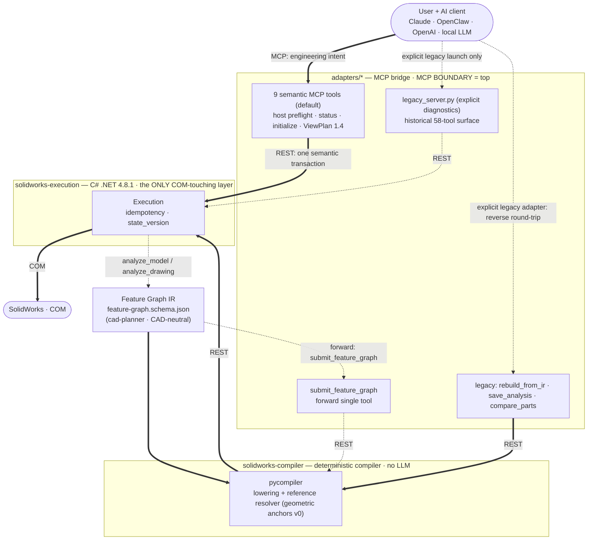

# Q3DS SolidWorks MCP

**An independently maintained fork of SolidPilot.**

> **Fork notice:** This repository is an independently maintained AGPL-3.0 fork of
> [`eyfel/mcp-server-solidworks`](https://github.com/eyfel/mcp-server-solidworks), based on upstream
> commit [`a7348f0`](https://github.com/eyfel/mcp-server-solidworks/commit/a7348f0). Fork modifications
> have been maintained by **Benny Cohen** since **2026-07-11**. See [NOTICE.md](NOTICE.md) for complete
> attribution.

This project is not affiliated with, authorized by, or endorsed by Dassault Systèmes or SOLIDWORKS.
SOLIDWORKS and related marks belong to their respective owners.

**AI-driven CAD automation for SolidWorks — an MCP (Model Context Protocol) server.**

SolidPilot lets an AI model work with SolidWorks at the **CAD feature level**. The goal is for the model to reason in terms of "which CAD intent am I realizing?" instead of "which API method should I call?". Intent is converted into a CAD-neutral intermediate representation, and a deterministic compiler lowers that representation into concrete SolidWorks operations.

SolidPilot is **not** a Claude-only plugin; it is **a general bridge between SolidWorks and AI.** Because MCP is an open standard, any MCP-capable AI client can connect — alongside Claude, OpenClaw, OpenAI-based agents, and local LLMs are also targeted. The architecture was designed for this extensibility **from the start**: the execution and planner layers do not know which client is calling them; a thin adapter per client reuses a shared bridge core. `adapters/claude/` is the current implementation; supporting a new AI client means only adding a new adapter.

> Upstream repository: `eyfel/mcp-server-solidworks` · Public name: **SolidPilot** · Legacy target: **SolidWorks 2026** · Semantic drawing path live-verified on **SolidWorks 2025 SP5**

## Fork additions

The default MCP server now exposes **9 engineering-semantic tools** and publishes the complete
structured ViewPlan 1.4 and `PlanningRequest` input schemas in the MCP tool catalog. The historical **58-tool**
surface is retained as `adapters/claude/legacy_server.py` for explicit development diagnostics;
it is not the agent-facing default. Atomic sketch, feature, view, selection, rebuild, save, and
COM operations remain available inside the execution service, where they can be serialized and
verified without spending model context on API plumbing.

The fork's earlier improvement passes add native sketch text,
single- and multi-view model screenshots, compact JSON responses, batched execution, compact
model inspection, revolved cuts, persistent HTTP connections, multi-region boss recovery, higher
volume precision, clearer diagnostics, a first native assembly slice (insert components,
coincident/concentric/distance mates via persistent face references, read-only assembly
analysis), and a reference-modeling workflow (load/crop design photos, reference-vs-model
comparison montages, an on-demand photo-to-part protocol). Eight SolidWorks Simulation tools add
static/topology study creation, fixtures, forces, meshing/solving, result extraction, topology
controls, study listing, and deletion. `knit_surfaces` joins surface bodies into one knit feature
(optionally forming a solid, with honest solid/open reporting). See [CHANGELOG.md](CHANGELOG.md)
for release history.

---

## Core Idea

The SolidWorks API exposes thousands of methods. Presenting each one to the AI as a separate "tool" explodes context size and token cost — the economic problem that stalls similar projects.

SolidPilot solves this by **raising the level of abstraction**:

- The AI produces intent at the **feature level** (for example, "put a hole in the top face").
- That intent is expressed as a CAD-neutral **Feature Graph IR**.
- A deterministic **compiler** lowers the IR into ordered, concrete SolidWorks operations.
- A single feature therefore maps to many low-level operations, and one model call per request is enough.

---

## Architecture



Read the diagram by line style: a **thick line works today**, a **dashed line is planned**, and a
dotted line is an explicit compatibility/diagnostic path. The default MCP boundary is deliberately
small and semantic. The old broad adapter remains available to maintain the existing compiler and
specialized workflows while those domains are migrated to the same transactional pattern.

The system has four layers:

| Layer | Directory | Language | Responsibility |
|---|---|---|---|
| Planner / Intent | `cad-planner/` | AI model + IR schema | Turns user intent into a CAD-neutral Feature Graph IR. Never touches COM, never emits raw tool calls. |
| Compiler | `solidworks-compiler/` | Deterministic (no LLM) | Lowers the IR into ordered tool calls; resolves semantic references (e.g. `top_face`, `center`) against live geometry state. |
| Execution | `solidworks-execution/` | C# (.NET Framework 4.8.1) | The **only** layer that touches the SolidWorks COM API. The single source of truth for CAD state. |
| Adapter | `adapters/claude/` | Python (FastMCP) | MCP protocol bridge. The MCP boundary sits at the **top** of the system. |

`adapters/codex/server.py` is a thin Codex-compatible launcher for the same shared semantic server;
it does not fork engineering behavior or duplicate tool implementations. The historical
`adapters/claude/` name is retained for compatibility.

**MCP sits at the top:** it is the boundary where the AI client meets the system, not an internal transport. Everything below the IR is deterministic and communicates over plain REST.

The `adapters/` layer is provider-specific and replaceable. Because the execution and planner layers do not know which client is calling, adding a new AI client (OpenClaw, OpenAI, a local LLM, etc.) means only writing a new adapter — the IR, compiler, and execution layers stay unchanged.

**Current vs. target:** the Feature Graph IR and deterministic compiler exist and have reproduced
real parts, but that compiler currently documents a non-transactional failure model. It is therefore
reachable only through the explicit legacy adapter. A future semantic part-build transaction must
add rollback, durable references, save/reopen verification, and objective acceptance before it can
join the default MCP surface.

---

## Agent-facing semantic tool surface

The default entry point, `adapters/claude/server.py`, exposes ten engineering-semantic tools; a
contract test fails if an executor-shaped operation leaks across the MCP boundary. All lengths are
meters.

- `solidworks_status` — read readiness without side effects, or explicitly launch SolidWorks.
- `inspect_solidworks_host` — run the repository-owned native x64 installation, registry,
  template, and filesystem preflight without launching SolidWorks or attempting repair.
- `bootstrap_solidworks_host` — run isolated bounded COM activation verification; registration
  repair is explicit-only and requires the Execution Service to already be elevated. See
  [the host-bootstrap integration contract](docs/HOST_BOOTSTRAP_INTEGRATION.md).
- `inspect_part_for_drawing` — read-only source preflight with exact configurations, localized
  standard-view names, and bounding box; restores the previous active document.
- `initialize_part_drawing_handoff` — transactionally create a verified blank drawing, readiness
  and topology reports, six real standard-view images, and a manifest-last immutable handoff. All
  SolidWorks COM, rollback, save/close/read-only-reopen checks, and hashing remain in C#.
- `plan_part_drawing_views` — call the repository PlannerEngine through MCP Sampling, apply all
  deterministic ViewPlan 1.4 gates, assess current executor capability, and atomically publish
  `view_plan.json` beside the verified initializer artifacts without launching SolidWorks.
- `publish_validated_part_drawing_view_plan` — accept exactly one complete candidate from an
  explicit upper-layer planning Skill, rerun the same repository gates and capability assessment,
  and atomically publish without overwrite or unverifiable model/prompt provenance.
- `validate_part_drawing_view_plan` — rerun the five deterministic gates and capability assessment,
  then ask the private C# validator to independently confirm the exact schema and executable subset
  without contacting SolidWorks or changing executor state.
- `create_part_drawing_from_view_plan` — transactionally execute a supported complete ViewPlan 1.4
  against a new output path after rebinding it to the original `PlanningRequest` and re-hashing all
  ten frozen artifacts; commit only after save, close, read-only reopen, and exact persisted readback.
- `verify_part_drawing_view_plan` — independently verify an existing committed drawing and audit
  sidecar read-only; successful verification never increments executor state.

ViewPlan 1.4 is the only drawing protocol published by the default MCP. Codex and other clients
receive its complete field, enum, range, discriminator, and nested-view schema during tool discovery.
The tools pass the unchanged ViewPlan object directly to repository-native private C#
operations; they never translate it to `DrawingPlan` 1.0. Unsupported section/detail/auxiliary
variants and center elements return `capability_blocked` before COM, so frozen
geometry, hashes, coverage, and layout constraints cannot be silently dropped.

The legacy [drawing-plan.schema.json](solidworks-execution/contracts/drawing-plan.schema.json) is
published only by the explicit DrawingPlan 1.0 compatibility server; it is not published by the
default MCP. It rejects unknown fields, ambiguous/forward parent references, diagonal projected-view placement,
invalid units/ranges, and unsafe paths. Verification reads back view identity, parentage, referenced
model/configuration/display state, scale, position, display/tangent-edge modes, position lock,
sheet bounds, and overlap clearance. A successful create also writes
`<output>.verification.json` with plan/artifact hashes and the post-reopen snapshot.

## Repository-owned drawing-view planning migration

The production target keeps planning and execution inside this repository:

```text
semantic MCP
        -> repository PlannerEngine or explicit upper-layer planning Skill
        -> validated schema-1.4 view_plan.json
        -> repository execution_client.py
        -> repository C# Execution Service
        -> private atomic COM operations + persisted verification
```

- The staged implementation and acceptance gates are documented in
  [VIEW_PLANNING_INTEGRATION_PLAN.md](docs/VIEW_PLANNING_INTEGRATION_PLAN.md).
- `$solidworks-plan-drawing-views` is a design/rules reference only; it is not part of the target
  production runtime and its files are not modified by this repository.
- `drawing_planner/planner_engine.py` owns model-call, deterministic-validation, capability-
  assessment and atomic-publication orchestration.
- `drawing_planner/capabilities/current.json` truthfully records what the repository C# executor can
  implement and verify. Planned or unsupported behavior produces `capability_blocked`; it is never
  downgraded.
- `drawing_planner/prompt_packs/<pack-id>/` contains tunable prompts. Each immutable pack has a
  strict manifest, semantic version, system/task templates, required placeholders, and a SHA-256.
  Packs remain subordinate to repository-owned core policy and contracts.
- `drawing_planner/prompt_pipeline.py` performs deterministic template injection. It rejects
  traversal, unknown fields/placeholders, missing contract inputs, malformed versions, and unsafe
  target names; it reads the SHA-256-locked repository ViewPlan 1.4 contract and never calls a model
  or SolidWorks.
- `drawing_planner/planning_prompt_compiler.py` is the production adapter used by PlannerEngine. It
  accepts only allow-listed profiles, revalidates the complete nine-artifact handoff before model
  use, and binds the manifest, core policy, prompt pack, schema, and envelope hashes into provenance.
- For prompt experiments, use the explicit `debug` planner profile and provide
  `debug_prompt_directory` in the `PlanningRequest`, or configure the local
  `PLANNER_DEBUG_PROMPT_DIRECTORY` environment variable. An explicit request path takes precedence.
  The directory must contain `skill.md` and `references/reference-map.md`. Debug planning first
  performs a schema-constrained, non-executing reference-routing sample against the verified
  handoff and six standard-view images. The repository validates the returned category, feature,
  and deferred Markdown paths against the map, then loads only `skill.md`, the map, all mapped base
  references, and the selected rules. PNG/JPG/JPEG links on the same map row as a selected Markdown
  rule are attached to the final sampling request as verified debug reference images; they remain
  separate from the nine-artifact handoff. The selected text, image list, media types, and SHA-256
  values are bound into the final prompt envelope. Deferred rules require the explicit structured user requirement
  `enable_deferred_tolerancing_rules: true`. `production` rejects this field, performs no routing sample, and continues to
  use only the repository pack.
- The repository PlannerEngine requires exactly one schema-constrained ViewPlan candidate through
  its non-executing MCP Sampling submission tool. Debug reference routing is a separate preliminary
  structured response and cannot publish a plan. The provider-neutral gateway pins provider/model
  identity and cannot call execution tools, Skills, CLIs, or COM operations.
- The semantic `plan_part_drawing_views` entry point supplies the exact response Schema as its sole
  MCP Sampling submission tool and injects the hash-verified handoff manifest, readiness/geometry
  JSON and six standard-view images. Client-provided Sampling with tools is preferred. For clients
  without that capability, an opt-in server-side fallback can call an OpenAI-compatible Chat
  Completions endpoint using `PLANNER_SAMPLING_API_KEY` and `PLANNER_SAMPLING_MODEL` (plus optional
  `PLANNER_SAMPLING_BASE_URL`). Set `PLANNER_SAMPLING_FALLBACK_ENABLED=true` in the ignored
  `adapters/claude/.env`; it is disabled by default and never implicitly reuses `OPENAI_API_KEY`.
  Without either a capable client or a configured fallback, planning fails explicitly and no text
  response or partial candidate is published. The fallback endpoint/model must accept image inputs
  and required function/tool calling.
- Clients that deliberately avoid Sampling may explicitly invoke
  `$solidworks-create-drawing-views`. The current Codex model reads the immutable `native-v4` pack,
  ViewPlan Schema, verified handoff reports and six images, generates exactly one candidate, and
  submits it directly to `publish_validated_part_drawing_view_plan`. The Skill never writes or
  repairs a candidate; the semantic MCP still owns validation, capability assessment, no-overwrite
  publication, creation and verification. This route needs no separate planning API or key.
- `RepositoryViewPlanValidator` applies the fail-closed gates in a fixed order: handoff integrity,
  Draft 2020-12 Schema (including RFC 3339 formats), engineering semantics, feature coverage, then
  sheet layout. An integrity or Schema failure marks every dependent gate `not_run`; no invalid
  candidate reaches capability assessment or publication.
- The selected planner profile deterministically derives the accepted `producer` name, prompt-pack
  version, ruleset ID and immutable ruleset SHA-256. The validator recomputes that contract from the
  repository prompt pack, so model output cannot claim an untrusted ruleset identity.
- The C# Execution Service independently validates the complete structured ViewPlan with its
  COM-free private `validate_frozen_part_drawing_view_plan` entry. Its runtime Schema is linked from the
  repository contract and SHA-256 locked; successful parsing does not imply view-execution support,
  start SolidWorks, or change executor state.
- The B2 private execution slice compiles schema-valid plans into a topologically ordered,
  fail-closed basic-view contract, then creates localized standard or exact named model views and
  uniquely parented projected views through native SolidWorks APIs. SolidWorks 2025 SP5 in-memory
  readback is verified. Explicit bases use an executor-owned read-only model and a fully restored
  temporary named-view transaction. The B3 no-overwrite disk transaction re-hashes ten frozen
  inputs before COM, saves and closes a new drawing, performs complete read-only reopen verification,
  writes a SHA-256 audit sidecar, and rolls back partial output on failure. A twelve-case SolidWorks
  2025 SP5 persisted matrix passed transaction-owned and independent reopen checks, so the public
  capability registry reports `model_view` and `projected_view` as `supported/live`.
- `drawing_planner/scripts/compile_prompt.py --request <request.json> --output <envelope.json>`
  exposes the same compiler to external orchestrators and refuses output overwrite.
- B4 registers the repository-native ViewPlan validate/create/verify tools as the only schema-1.4
  execution path on the default MCP surface. D3 removed the superseded external bridge files and
  Skill/CLI prompt path after the native validation/execution matrix passed.
- C1 adds native `full_section`, `half_section`, `offset_section`, `aligned_section`, and
  `removed_section` execution inside the private C# transaction. Frozen feature IDs and axes are
  resolved before COM; section paths, labels, parentage, placement, segment structure, normalized
  line geometry, partial/aligned/reversed flags, scale, and depth semantics are read back before
  save, after close/read-only reopen, and during independent verification. The SolidWorks 2025 SP5
  five-type persisted matrix passed, so capability manifest 0.6.0 reports these view types and
  section labels as `supported/live`.
- C2 adds native circular `broken_out_section` and parent-derived circular `detail_view` execution.
  The private executor freezes and checks local-view geometry before COM, uses native
  `CreateBreakOutSection`/`CreateDetailViewAt4`, and verifies boundary/profile geometry, depth,
  parentage, labels, styles, outlines, scale, placement, and persistent handles before save, after
  close/read-only reopen, and during independent verification. SolidWorks 2025 SP5 passed the
  two-type persisted matrix plus a jagged-detail intensity case, so capability manifest 0.7.0
  reports both C2 view types as `supported/live`; unsupported broken-out reversal still fails
  before COM without downgrade.
- C3 adds native parent-derived `auxiliary_view` execution with unique frozen visible-edge
  resolution. The private executor verifies parent linkage, aligned/detached placement, scale,
  label and arrow readback, and derives the actual flip state from the persisted orientation
  transform because SolidWorks does not update `IView.FlipView`. SolidWorks 2025 SP5 passed both
  alignment modes and both flip directions through transaction-owned and independent reopen, so
  capability manifest 0.8.0 reports auxiliary views as `supported/live`. The native API ignores
  `show_arrow=false` and has no visibility setter; at the C3 checkpoint, hidden arrows and explicit
  auxiliary-label placement were therefore capability-blocked before COM.
- C4 adds feature-bound native center marks and horizontal/vertical symmetry centerlines. Frozen
  geometry resolves circular feature edges before COM; native style/group/count, attached linear
  edges, color, document defaults, and absence of unplanned center elements are verified before
  save, after close/read-only reopen, and during independent verification. It also adds strict
  explicit detail-label placement using bounded native direction/readback inversion and explicit
  auxiliary-label placement through a deterministic leaderless native note owned by the parent
  view. The auxiliary renderer preserves the native projection arrow, clears only its
  non-positionable text, copies its text format, and strictly verifies owner, name, visibility,
  text, format, and position. SolidWorks 2025 SP5 passed persisted center-element, detail-label,
  and aligned plus detached/flipped auxiliary-label cases through transaction-owned and independent
  reopen. Capability manifest 1.0.0 reports all C4 elements as `supported/live`; hidden auxiliary
  arrows remain capability-blocked because SolidWorks ignores `show_arrow=false` and exposes no
  visibility setter.
- D1 provides one repository-owned offline/integration/live matrix runner. It executes fixed
  Planner, compiler, semantic MCP, Python bytecode, and 45 private C# ViewPlan contracts, then
  builds the x64 Execution Service and runs 13 real SolidWorks cases from read-only `validation/`
  inputs. Every case writes logs, hashes, return codes, new drawings, and audit sidecars only under
  a fresh output directory. On SolidWorks 2025 SP5, all 13 cases passed in-memory, save/close/
  read-only-reopen, and independent verification with identical normalized fingerprints; the
  temporary service exited cleanly and the complete `validation/` tree remained byte-identical.
  Hidden auxiliary arrows remain fail-closed because SolidWorks ignores `show_arrow=false`.
- E0 closes the release candidate on the post-D4 codebase. The final six-case matrix passed all
  offline, integration, and live lanes; its SolidWorks 2025 SP5 lane passed 13/13 persisted cases.
  A separate real stdio MCP smoke then discovered only the three DrawingPlan 1.0 compatibility
  tools and passed validate/create/verify with executor state `0 -> 1 -> 1`. Both runs preserved
  the four-file `validation/` tree at SHA-256
  `0638a043ab5bcec518a6437f879b4705f33fa0ad36b25676f4e34b47aa759d7e`.
  See [the E0 release-candidate report](docs/E0_RELEASE_CANDIDATE_REPORT.md).
The production profile uses the immutable `native-v4` view-selection-expert pack and prompt-request contract 3.0. The
retired `baseline` pack remains unchanged as migration history but is not runtime-selectable. To add
or tune a prompt set, create a new pack ID/version from `native-v4` and replace its Markdown
templates while retaining the compiler-owned placeholders. Prompt text does not belong in
`AGENTS.md`, tool descriptions, or the C# executor.

## Explicit DrawingPlan 1.0 compatibility

Native DrawingPlan 1.0 callers can explicitly start
`adapters/claude/drawing_plan_compat_server.py`. It exposes only
`validate_part_drawing_plan`, `create_part_drawing`, and `verify_part_drawing`, with the complete
structured 1.0 Schema. It never accepts or converts ViewPlan 1.4 and routes create/verify only to
the existing private C# DrawingPlan transactions. This server is deliberately absent from the
default `.codex/config.toml`.

```powershell
powershell.exe -NoProfile -ExecutionPolicy Bypass -File scripts\start_drawing_plan_compat_mcp.ps1
```

Maintainers can reproduce the real stdio MCP validate/create/verify smoke with
`scripts/run_drawing_plan_compat_live_smoke.py`; it requires a fresh output directory and a built
x64 Execution Service, owns only the child processes it starts, and verifies that `validation/`
remains byte-identical.

For an explicit Codex registration:

```powershell
codex mcp add solidpilot-drawing-plan-v1 -- powershell.exe -NoProfile -NonInteractive -ExecutionPolicy Bypass -File C:\src\solidpilot\scripts\start_drawing_plan_compat_mcp.ps1
```

## Legacy diagnostic surface

`adapters/claude/legacy_server.py` retains the earlier 58-tool MCP adapter for maintainers and
compiler compatibility. It is intentionally not used in the registration examples below. The
private execution operations it exercises include the following areas:

### Document and lifecycle
- `ensure_ready` — launches SolidWorks via COM and attaches if it is closed (does not open a document).
- `open_new_part` — opens a new part document.
- `open_document` — opens an existing file from disk (native `.sldprt`/`.sldasm`/`.slddrw`; imports `.ipt`/`.CATPart`/STEP/IGES via 3D Interconnect when the translator is available, otherwise returns a clear `OPEN_FAILED`).
- `activate_document` — switches between open documents.
- `save_document` — saves the part or drawing to disk.
- `close_document` — closes the document.

### Sketch
- `create_sketch` — starts a sketch on a plane or a selected face.
- `edit_sketch` — reopens an existing sketch for editing.
- `add_sketch_entity` — adds a sketch entity: line, circle, arc, center arc, ellipse, spline, rectangle, fillet, chamfer.
- `add_sketch_text` — adds TrueType sketch text with anchor, height, rotation, bold/italic, and font controls. The resulting contours can be raised with a boss or engraved with a cut. For text on a model surface, use a reference plane at the surface height; a face sketch may also capture and extrude the face outline.
- `add_sketch_constraint` — adds a sketch relation (horizontal, coincident, etc.).
- `add_dimension` — adds a dimension to the sketch.

### Feature and solid modeling
- `extrude_feature` — boss, cut, revolve, **revolve_cut**, sweep, loft.
- `add_edge_feature` — fillet or chamfer on a solid edge (chamfer: distance-angle at any angle, or distance-distance).
- `create_rib` — rib feature from an open sketch profile.
- `add_reference_geometry` — reference plane, axis, or point.
- `create_pattern` — linear or circular pattern.
- `sheet_metal_feature` — sheet metal: base_flange, edge_flange (incl. custom-profile flanges), sketched_bend, flat_pattern.

### Editing
- `modify_dimension` — changes the value of a named dimension (the basis for variants).
- `edit_feature` — suppresses, unsuppresses, deletes, or renames a feature.

### Material
- `set_part_material` — assigns a material to the part.

### Analysis and query
- `analyze_model` — `geometry`, `mass_properties`, `features` (a compact feature-level recipe), `edges`, `faces`, `sketch` (one sketch's exact segments on demand), and `feature_map` (per-feature consumed/created topology — the source of the reference-resolver anchors) modes.
- `capture_view` — orients the active model to a named view, zooms to fit, and returns a PNG directly as MCP image content; an optional path also saves the image to disk.
- `capture_view_set` — returns one labelled PNG montage containing up to four synchronized named views.
- `inspect_model` — returns compact topology, mass, optional feature summary, and an optional multi-view montage in one call.
- `get_selection` — reads the geometry the user selected in the SolidWorks GUI and maps it to the analyze index.
- `verify_state` — returns the current state and feature tree.

### Agent efficiency
- `execute_batch` — runs up to 100 ordered low-level operations in one MCP call; exact references such as `$last.features.0` reuse earlier results.
- `search_solidworks_references` — searches locally indexed SolidWorks books and returns short, page-cited passages. Source PDFs and extracted page indexes remain local under `.solidpilot/` and are not committed.

### Local book references

Put machine-specific PDF paths in `.solidpilot/references.json`, then build the ignored page index:

```powershell
python scripts/build_reference_index.py
```

The indexer requires `pypdf`. It stores page text in `.solidpilot/reference-index/`; the MCP search tool returns compact snippets with the book title, PDF page number, and original local path. Rebuild the index after replacing a PDF.
- `solidworks_help` — returns detailed workflow guidance only when requested, keeping the always-loaded tool schema substantially smaller.

### Analysis pipeline & IR round-trip
These tools implement the reverse-engineering loop — *"the LLM proposes, the round-trip decides"* — that reproduces an existing part from a CAD-neutral Feature Graph IR and objectively verifies the result.

- `save_analysis` — writes an **analysis artifact** for the active part (feature recipe, driving parameters, and an optional Feature Graph IR block) to `<folder>/.solidpilot/`.
- `rebuild_from_ir` — the mainline IR door: runs an artifact's IR block through the deterministic compiler to rebuild the part in a fresh document (same compiler that the future `submit_feature_graph` will use — two doors, one compiler).
- `compare_parts` — objective two-part diff (topology, volume, area, center of mass) with the project's `verified` verdict (topology-exact **and** |ΔV| ≤ 1% **and** |ΔA| ≤ 1%).

### Drawing
The drawing tools were added after the initial part-modeling set and are now a substantial — though still maturing — capability. They are enough to take a model to a dimensioned multi-view drawing, and to read a drawing back for reverse-engineering.

- `create_drawing` — creates a drawing document (A3 sheet).
- `add_drawing_view` — adds a model view: `front`, `top`, `right`, `isometric`, `back`, `bottom`, `left`.
- `add_flat_pattern_view` — adds a sheet-metal **flat-pattern** view (the unfolded blank with bend lines and bend notes); the correct, standard way to detail sheet-metal parts.
- `auto_dimension_drawing` — transfers the model's driving dimensions into the views (the "Insert Model Items" automation) — the robust alternative to placing dimensions by coordinate.
- `auto_center_marks` — automatically inserts center marks and centerlines on every hole/slot.
- `add_hole_callout` — adds a hole callout on a hole edge.
- `add_drawing_dimension` — adds a single dimension by sheet coordinate.
- `add_section_view` — section view (**experimental**; the API path works on a clean drawing state but is not yet reliable under automation — see Project Status).
- `analyze_drawing` — reads the active drawing structurally: per-view name/type/scale/position and its dimensions; with `include_geometry`, it also returns each view's **projected 2D geometry as clean primitives** (lines and curves), which is the clean shape used to reverse-engineer a part from its drawing independently of dimension-line clutter.

### Export
- `export_document` — STEP, IGES, STL, **PDF, DWG, DXF** (PDF/DWG/DXF require a drawing document).
- `batch_export` — batch export.

---

## Fast screenshot-driven workflow

For a part described by photographs or screenshots:

1. Extract explicit dimensions, symmetry, repeated-feature counts, datums, and silhouettes. If no
   scale is visible, state a concept scale instead of implying an exact copy.
2. Build the master body and primary datums first. Use `execute_batch` for dense sketch/entity
   sequences that do not require visual judgment between calls.
3. After each major feature, call `inspect_model`. Its compact topology/mass summary and labelled
   top/isometric/right/front montage make planform, height, taper, and junction errors visible at once.
4. Correct the modelling cause, then inspect again. Finish by checking body count, open holes,
   pattern instances, feature names, and mass properties.

Detailed instructions stay out of the always-loaded schema and are available through
`solidworks_help(topic="visual_assignment")` or the other help topics.

Example batch payload:

```json
{
  "operations": [
    {"tool": "create_sketch", "params": {"plane": "Top Plane"}},
    {"tool": "add_sketch_entity", "params": {
      "entity_type": "rectangle", "x1": 0, "y1": 0, "x2": 0.04, "y2": 0.02
    }},
    {"tool": "extrude_feature", "params": {"feature_type": "boss", "depth": 0.01}}
  ]
}
```

---

## Installation and Running

### Requirements

- Windows with **SolidWorks 2025 SP5 or 2026**. The semantic drawing transaction is live-verified
  on 2025 SP5; several legacy modeling/simulation operations were originally developed on 2026.
- **.NET Framework 4.8.1 Developer Pack** and MSBuild for the execution layer (available with Visual Studio 2022).
- **Python 3.12** for the hash-pinned Windows dependency lock and CI parity.
- An MCP client that can launch a local stdio server, such as Claude Desktop or Codex.

Run the following commands from the repository root in PowerShell. The examples below assume the
repository is at `C:\src\solidpilot`; replace that path with the absolute path to your clone.

### Python environment

```powershell
py -3.12 -m venv .venv
& .\.venv\Scripts\python.exe -m pip install --require-hashes -r requirements.lock
Copy-Item adapters\claude\.env.example adapters\claude\.env
```

The checked-in `.env.example` contains only local defaults. `adapters/claude/.env` is ignored by
Git and is loaded relative to `server.py`, regardless of the MCP client's working directory.
Contributors should install `requirements-dev.lock` instead; see [CONTRIBUTING.md](CONTRIBUTING.md).

### Execution layer (C#)

Build the solution:

```powershell
$env:SOLIDWORKS_INTEROP_DIR = "D:\SolidWorks 2025\SOLIDWORKS"
$env:SOLIDWORKS_API_REDIST_DIR = "D:\SolidWorks 2025\SOLIDWORKS\api\redist"
& "C:\Program Files\Microsoft Visual Studio\2022\Community\MSBuild\Current\Bin\MSBuild.exe" solidworks-execution\SolidworksExecution.sln /t:Build /p:Configuration=Debug
```

Set the two Interop variables only when SolidWorks is not installed in the standard `C:\Program
Files\SOLIDWORKS Corp\SOLIDWORKS` location. Adjust `Community` if a different Visual Studio edition
is installed. The project compiles x64 because SolidWorks COM is x64. The adapter automatically
starts the built execution server when `http://localhost:5000/health` is unavailable. To start it
yourself for troubleshooting:

```powershell
Start-Process .\solidworks-execution\SolidworksExecution\bin\Debug\SolidworksExecution.exe -WindowStyle Hidden
```

### Adapter (Python)

Run the stdio adapter directly for a smoke test:

```powershell
& .\.venv\Scripts\python.exe .\adapters\claude\server.py
```

Maintainers can explicitly launch `adapters\claude\legacy_server.py` for the historical broad
diagnostic surface. Do not register that entry point for normal agent use.

The adapter connects to the execution layer at `EXECUTION_BASE_URL` (default
`http://localhost:5000`). See [adapters/claude/.env.example](adapters/claude/.env.example) for all
supported local settings.

### Claude Desktop registration

Open this file:

```text
C:\Users\<username>\AppData\Roaming\Claude\claude_desktop_config.json
```

Use a complete configuration object like this, updating both absolute paths:

```json
{
  "mcpServers": {
    "solidpilot": {
      "command": "C:\\src\\solidpilot\\.venv\\Scripts\\python.exe",
      "args": [
        "C:\\src\\solidpilot\\adapters\\claude\\server.py"
      ],
      "env": {
        "EXECUTION_BASE_URL": "http://localhost:5000"
      }
    }
  }
}
```

Restart Claude Desktop after saving the file.

### Codex registration

The repository includes `.codex/config.toml`, so a trusted Codex project discovers the `solidpilot`
STDIO server automatically. It launches `adapters/codex/server.py` through the repository's `.venv`,
allow-lists exactly the nine default semantic tools, and prompts before write-class operations. Confirm with:

```powershell
codex mcp list
```

Restart the Codex session after first trusting the project. Repository planning and execution are
self-contained; no installed drawing-planner or ViewPlan-executor Skill/CLI is required at runtime.

For a user-global registration instead, Codex can register the stdio server from PowerShell:

```powershell
codex mcp add solidpilot -- "C:\src\solidpilot\.venv\Scripts\python.exe" "C:\src\solidpilot\adapters\claude\server.py"
codex mcp get solidpilot
```

Alternatively, add the following to `$HOME\.codex\config.toml`:

```toml
[mcp_servers.solidpilot]
command = 'C:\src\solidpilot\.venv\Scripts\python.exe'
args = ['C:\src\solidpilot\adapters\claude\server.py']

[mcp_servers.solidpilot.env]
EXECUTION_BASE_URL = 'http://localhost:5000'
```

Start a new Codex task after changing MCP configuration so the 9-tool semantic surface is discovered.

### Other MCP clients

Configure a **stdio** MCP server with these fields in the format your client expects:

```text
name: solidpilot
command: C:\src\solidpilot\.venv\Scripts\python.exe
args: [C:\src\solidpilot\adapters\claude\server.py]
environment: EXECUTION_BASE_URL=http://localhost:5000
```

The MCP transport is stdio between the client and `server.py`. The local HTTP endpoint is an
internal adapter-to-execution connection and should not be exposed to another machine. After any
`server.py` change, reconnect or restart the MCP client because the adapter does not hot-reload.

---

## Project Status

SolidPilot is a **working prototype / early alpha** overall. The default part-drawing path is a
transactional, disk-reopen-verified workflow, live-validated on SolidWorks 2025 SP5.0 with the
repository's validation part and A3 template. Legacy domains remain at varying maturity. All COM
calls are serialized on a single dedicated STA thread.

**Parts:** the part-modeling surface is the most mature — sketches, extrude/revolve/sweep/loft, fillets/chamfers, patterns, sheet metal, reference geometry, plus editing (`modify_dimension`, `edit_feature`) and rich analysis. Initially only the tools needed for part creation existed.

**Technical drawing:** added later and now a real (if still maturing) capability — multi-view drawings, model-item auto-dimensioning, center marks, hole callouts, sheet-metal flat-pattern views, and a structural drawing reader. The reverse direction (**drawing → model**) has been demonstrated: a part reconstructed from its drawing alone (read via `analyze_drawing(include_geometry)`) matched the original exactly in volume, surface area, and topology. Section views are experimental and not yet reliable under automation.

**Feature Graph IR + compiler (the strategic core):** now the project's spine and **working**. The IR schema (`cad-planner/contracts/feature-graph.schema.json`) and a deterministic Python compiler (`solidworks-compiler/pycompiler`, lowering + a **v0 reference resolver** built on geometric anchors) run every rebuild through one code path, with an offline test suite (no live SolidWorks needed). Via the reverse round-trip — `analyze_model` → an LLM-proposed IR → `rebuild_from_ir` → `compare_parts` — real production parts have been reproduced from their IR to a `verified` match, spanning revolves, circular patterns, both chamfer modes, lofts, and multi-bend sheet-metal forms. Each part is rebuilt in a fresh document and checked against the original by exact topology and mass properties before it counts as verified. Growing the IR vocabulary from real parts is how it advances.

The open problem — and the project's real research risk — is a **durable reference resolver**: the v0 geometric anchors reproduce a part exactly in a fresh document but do **not** survive upstream edits (a changed dimension moves the anchors). Making semantic references (`top_face`, a specific edge) robust across topology changes is the make-or-break module still ahead.

> **Two IR doors, one compiler.** The legacy adapter retains `rebuild_from_ir` (reproduce from an
> artifact). A forward `submit_feature_graph` door remains future work because the existing compiler
> is explicitly non-transactional; it will not join the default semantic surface until rollback and
> disk-level verification meet the same contract as the drawing transaction.

**Testing:** Windows CI installs `requirements-dev.lock` with hash verification, checks the 9-tool
semantic contract and private execution dispatcher, runs strict drawing-plan tests and the offline
compiler tests, and compiles the Python sources.
Behavioral verification against live SolidWorks remains manual by design.

Notes:
- The Python MCP adapter does not hot-reload while running; after editing `server.py`, the MCP server must be reconnected.

---

## Roadmap

The project is under active development. The Feature Graph IR and deterministic compiler now work for parts (verified end-to-end on real production parts); the main next goals:

- **Durable reference resolver / persistent naming** — the critical module: making semantic references (`top_face`, a specific edge) survive dimension and topology changes, not just fresh-document replay. The current v0 geometric anchors are exact but edit-fragile.
- **Assembly (V2)** — the next domain: `analyze_assembly` (read-first), an assembly IR sub-vocabulary (components + mates), component insertion and mating, and round-trip verification for assemblies.
- **Analysis pipeline breadth** — a folder scanner (batch-analyze a directory of parts/drawings into artifacts), an AI pass that generates IR per category with a coverage report, and pattern reuse across verified IRs (parametric rebuilds without an LLM).
- **Forward IR surface** — collapsing the low-level tools under the single `submit_feature_graph` interface once the vocabulary and resolver are ready.

Coming soon in existing areas:

- **Technical drawing:** the core tools exist; remaining work is reliable section views, GD&T / datums, title blocks, detail views, and a bill of materials (BOM).
- **Assembly drawings / BOM** and broader engineering-analysis support.

---

## Contributing

For development setup, contribution workflow, and the DCO sign-off requirement, see
[CONTRIBUTING.md](CONTRIBUTING.md) and [CLA.md](CLA.md). Security reports follow
[SECURITY.md](SECURITY.md).

---

## License

Copyright (c) 2025–2026 Çağatay Bakan.

Copyright (c) 2026 Benny Cohen for fork modifications beginning 2026-07-11.

SolidPilot is free software, licensed under the
[GNU Affero General Public License v3.0](LICENSE) (AGPL-3.0).

You may use, study, modify, and distribute it freely. Because SolidPilot is
server software, the AGPL's network clause (§13) applies: **if you run a
modified version and let others interact with it over a network, you must offer
those users the complete corresponding source of your modified version, under
the same license.** See the [LICENSE](LICENSE) for the exact terms.

This fork is offered under the AGPL-3.0 only. The fork maintainer does **not** claim authority to
offer a proprietary or commercial license for the combined upstream-and-fork work. Anyone seeking
different terms must obtain all necessary permissions from the relevant copyright holders. See
[NOTICE.md](NOTICE.md) for lineage, scope, and trademark notices.
